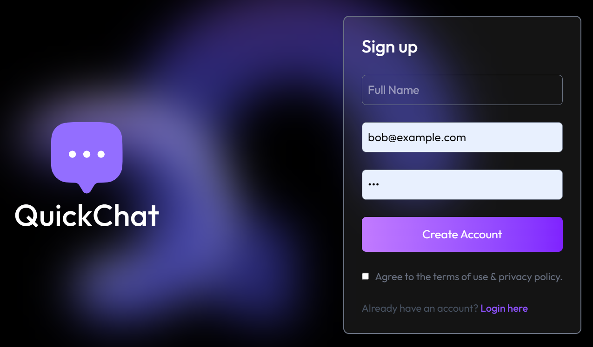
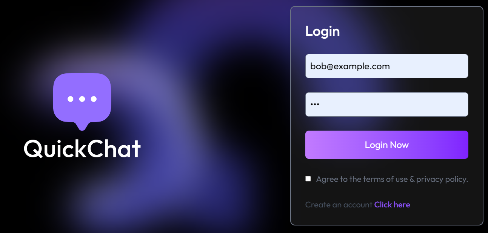

# 💬 Chat App

A powerful full-stack real-time messaging app built with the **MERN stack (MongoDB, Express, React, Node.js)** and **Socket.IO**. It supports one-on-one and group chats, live online user tracking, typing indicators, profile management, and more — all in a beautifully responsive UI.


---
## 🚀 Live Preview

You can try the live version of this project here:

🔗 [Click to Visit the Live App](https://chat-app-frontend-ten-eta.vercel.app/login)

## 🚀 Features

### 🔐 Authentication
- Secure Sign Up & Login using **JWT**
- Profile picture upload with base64 encoding
- Persistent session via local storage

### 💬 Chat System
- **One-to-one messaging**
- **Group chat** with:
  - Admin controls
  - Add/Remove members
  - Rename group / Change admin
- Real-time messaging using **Socket.IO**

### 👥 User Experience
- Typing indicators
- Online users tracking
- Unseen message count
- Responsive and mobile-first UI with **Tailwind CSS**
- User avatars with random background colors

---

## 🛠️ Tech Stack

| Frontend        | Backend       | Real-Time  | Styling         |
|-----------------|---------------|------------|-----------------|
| React.js        | Node.js       | Socket.IO  | Tailwind CSS    |
| Axios           | Express.js    | WebSocket  | React Hot Toast |
| React Router DOM| MongoDB Atlas | JWT Auth   |                 |

---

## 🖼️ Screenshots

### 1. Register Page



### 2. Login Page


### 3. Profile Page


### 4. Home Page


### 5. Group Chat


### 6. Group Members Panel


### 7. Admin Controls


## ⚙️ Getting Started

### 1️⃣ Clone the Repository

```bash
git clone https://github.com/kenil-rajodiya/Chat-App.git
cd Chat-App
```

---

### 2️⃣ Backend Setup

```bash
cd server
npm install
```

Create a `.env` file inside the `server/` directory with:

```env
PORT=5000
MONGO_URI=your_mongodb_uri
JWT_SECRET=your_jwt_secret
```

Then run the backend server:

```bash
npm run dev
```

---

### 3️⃣ Frontend Setup

```bash
cd ../client
npm install
npm run dev
```

The app will be available at:  
👉 `http://localhost:5173`

## 📦 API Endpoints

### 🔐 Auth (`/api/auth`)
| Method | Endpoint              | Description                      |
|--------|------------------------|----------------------------------|
| POST   | `/signup`             | Register a new user              |
| POST   | `/login`              | Log in an existing user          |
| GET    | `/check`              | Check if user is authenticated   |
| PUT    | `/update-profile`     | Update profile (name, bio, pic)  |

---

### 💬 Messages (`/api/messages`)
| Method | Endpoint                  | Description                         |
|--------|----------------------------|-------------------------------------|
| GET    | `/users`                  | Get all users for sidebar           |
| GET    | `/:id`                    | Get 1-to-1 chat with a user         |
| POST   | `/send/:id`               | Send a message to a user            |
| PUT    | `/mark/:id`               | Mark message as seen                |

---

### 👥 Group Chat (`/api/group`)
| Method | Endpoint                         | Description                           |
|--------|-----------------------------------|---------------------------------------|
| POST   | `/create`                        | Create a new group                    |
| GET    | `/get`                           | Get groups the user is a part of      |
| PUT    | `/editName/:groupId`            | Rename the group                      |
| PUT    | `/changeAdmin/:groupId`         | Change group admin                    |
| PUT    | `/addMember/:groupId`           | Add member(s) to group                |
| PUT    | `/removeMember/:groupId`        | Remove member(s) from group           |
| PUT    | `/removeSelf/:groupId`          | User removes self from group          |
| DELETE | `/delete/:groupId`              | Delete the group (admin only)         |

---

### 📡 Group Messages (`/api/group-messages`)
| Method | Endpoint              | Description                    |
|--------|------------------------|--------------------------------|
| POST   | `/send/:groupId`      | Send message to a group        |
| GET    | `/:groupId`           | Get all messages from a group  |

---

### 🌐 Status Check
| Method | Endpoint      | Description               |
|--------|----------------|---------------------------|
| GET    | `/api/status` | Check if server is up     |


## 🙌 Author

**👨‍💻 Kenil Rajodiya**

- 🔗 [GitHub Profile](https://github.com/kenil-rajodiya)
- 📬 Always open to feedback, ideas, or contributions!

---

> ⭐ Don’t forget to **star** the repository if you find it useful!
